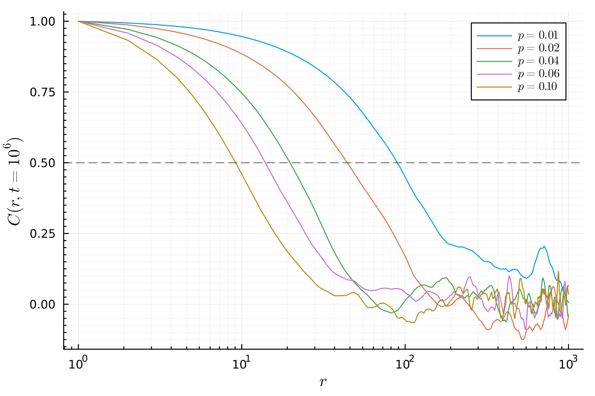
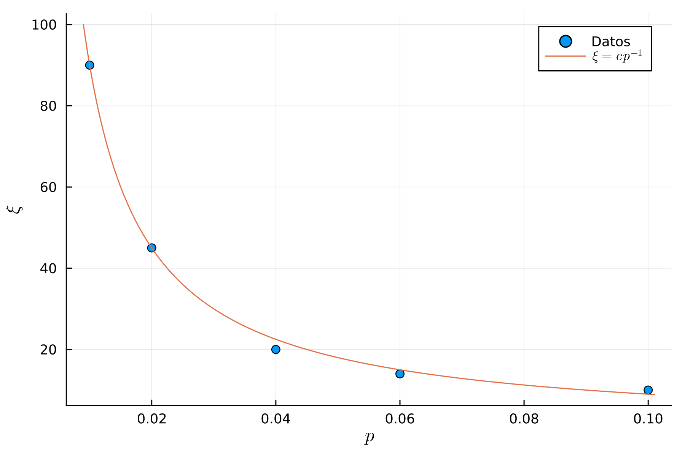
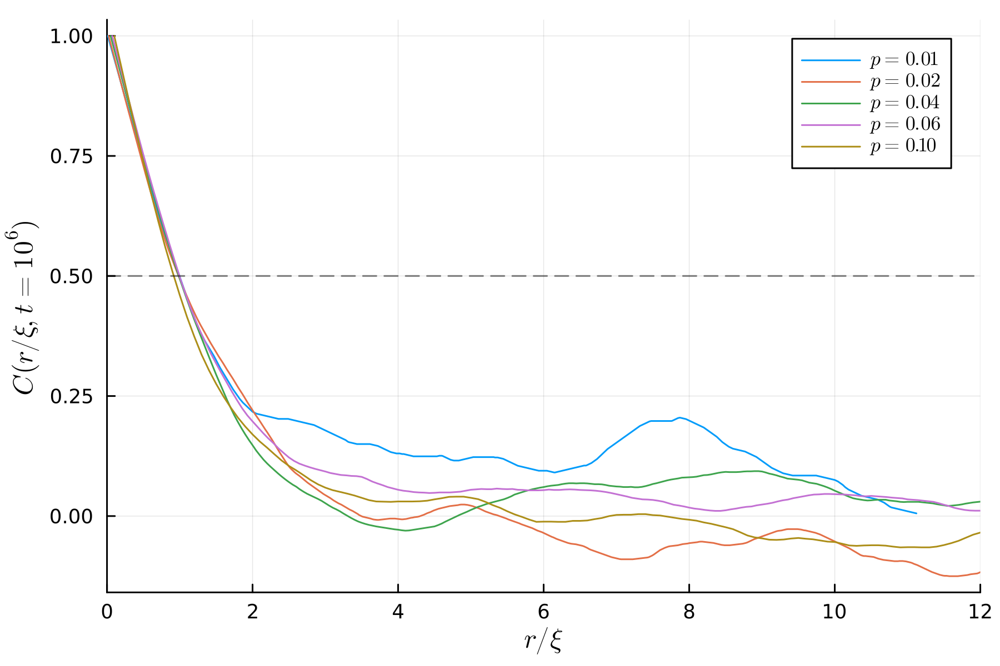

# Problema 2
El problema nos pide escribir una simulación del modelo de Ising. En nuestro caso, vamos a trabajar en la configuración sin campo, donde el hamiltoniano es

$$ \mathcal{H} = - J \sum_{i,j} \sigma_i \cdot \sigma_j .$$

Vamos a trabajar a temperatura $T=0$. Por otro lado, la topología elegida es una red tipo Watts-Strogatz, en la configuración de una dimensión. En este modelo, los $N$ nodos se disponen inicialmente conformando un anillo (es decir, cada nodo $i$ está conectado con los nodos $[i+1,i-1]$, con condiciones periódicas de contorno). Luego, para cada nodo $i$, se sortea con probabilidad $p$ un nuevo enlace entre $i$ y otro nodo $j$ al azar. 

Entonces, lo primero que vamos a hacer es implementar esta red. Para simular luego el modelo de Ising sobre esta topología, es conveniente representarla por medio de la lista de vecinos, para lo cual vamos a utilizar diccionarios. 

```julia
function WS_1D(N: entero, p: flotante, semilla: entero) -> diccionario
// Generador de números aleatorios 
    rng = MersenneTwister(semilla)  
    nl = diccionario vacío
    para i de 2 a N-1 hacer
        nl[i] = lista vacía
        agregar nl[i], i-1, i+1
    fin para
    nl[1] = [2, N]  // Condiciones periódicas
    nl[N] = [1, N-1]
    nodos = crear lista de 1 a N
    para i de 1 a N hacer
        si random(rng) < p entonces
            j = i
            mientras i == j hacer
                j = random(rng, nodos, 1)[0]
            fin mientras
            agregar nl[i], j
            agregar nl[j], i
        fin si
    fin para
    devolver nl
end function
```
Con la topología ya construida, podemos hacer implementar el algoritmo para simular el modelo de Ising haciendo Montecarlo.

1. El primer paso es implementar una función que calcule el $\Delta E$ de hacer _flip_ en un spin $i$ del sistema.

```julia
function get_E(nl:diccionario,spins:vector,i:entero) -> entero
    E0 = - suma(spins[i] * spins[j] para todo j en nl[i])
    E  = - sum((-spins[i]) * spins[j] para todo j en nl[i])
   devolver E - E0
end
```
2. Completar la implementación de la dinámica
```julia
function Ising(N,p,t,seed)
    rng = MersenneTwister(seed)
    nl = WS_1D(N,p,seed)
    // Inicializamos aleatoriamente N spines up (1) y down (-1)
    spins = sample(rng,[-1,1],N)
    nodes = collect(1:N)
    for t in 1:t 
        i = rand(rng,nodes,1)[1]
        deltaE = get_E(nl,spins,i)
        if deltaE < 0
            spins[i] = - spins[i]
        elseif deltaE == 0
            if rand(rng) < 0.5
                spins[i] = - spins[i]
            end
        end
    end
    return spins
end
```
La función implementada hace $t$ iteraciones en las que intenta flipear un spin. Ahora, para un sistema de $10^5$ spines, evolucionar el sistema durante $10^6$ Montecarlo steps (lo que pide el ejercicio) implica un total de $10^11$ iteraciones. En mi máquina eso demora un total de 13 hs. Por lo tanto, lo que hice fue bajar un orden de magnitud el sistema, y simular una cadena de $10^4$ spines, durante $10^6$ MC steps. 

La simulación se corrió una vez para diferentes $p=0.01,0.02,0.04,0.06,0.10$. Con el sistema relajado, lo que se hizo fue medir la función de correlación 

$$C(r,t=10^6) = \langle \sigma_i \sigma_{i+r}\rangle$$ 

para $r\in [0,1000]$. Esto nos permitirá estimar la longitud de correlación $\xi$, definida por $C(\xi,t=10^6) = 0.5$. Las curvas se ven en la Fig. 1.



Revisando los datos obtenidos, se encuentran las siguientes longitudes de correlación $\xi$ para cada $p$ estudiado, tal como se ve en la Fig. 2. 



Con estas longitudes de correlación, es posible hacer un reescaleo de las curvas de la Fig. 1, definiendo una distancia reducida $r/\xi$. Con esto, se puede ver en la Fig. 3 que todas las curvas colapsan para valores pequeños de $r/\xi$.

