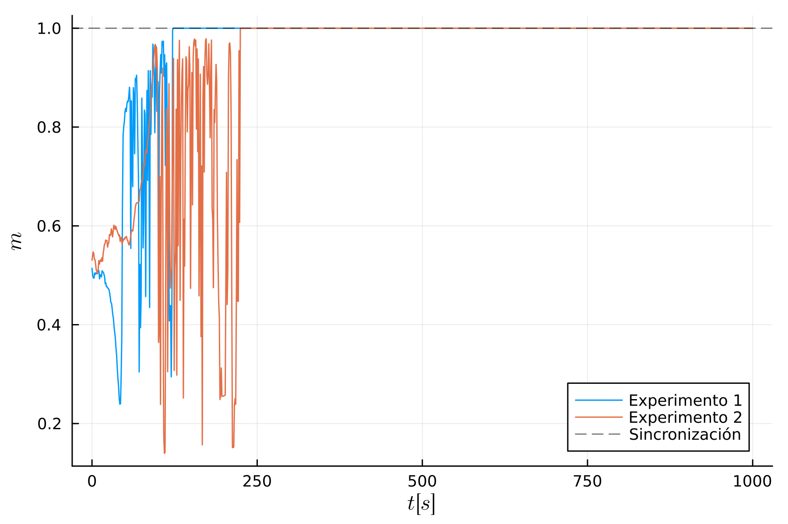
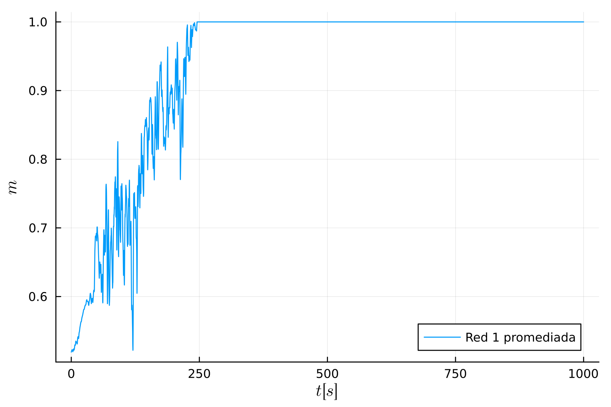
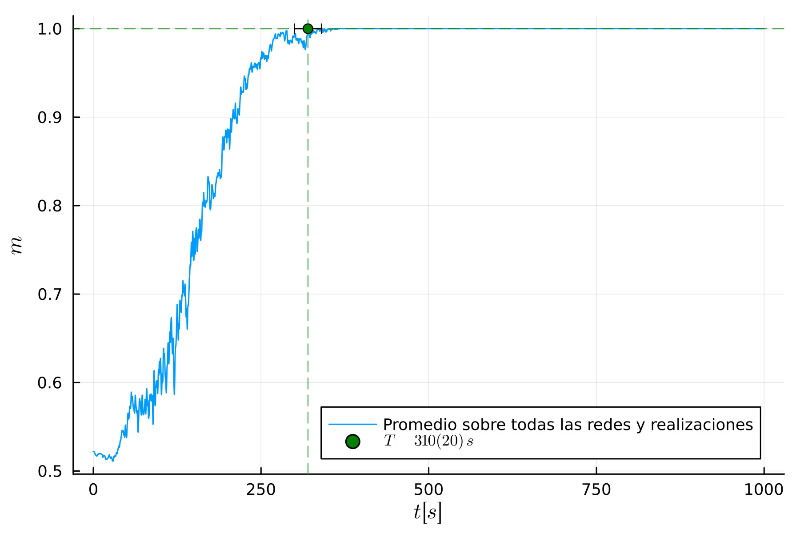
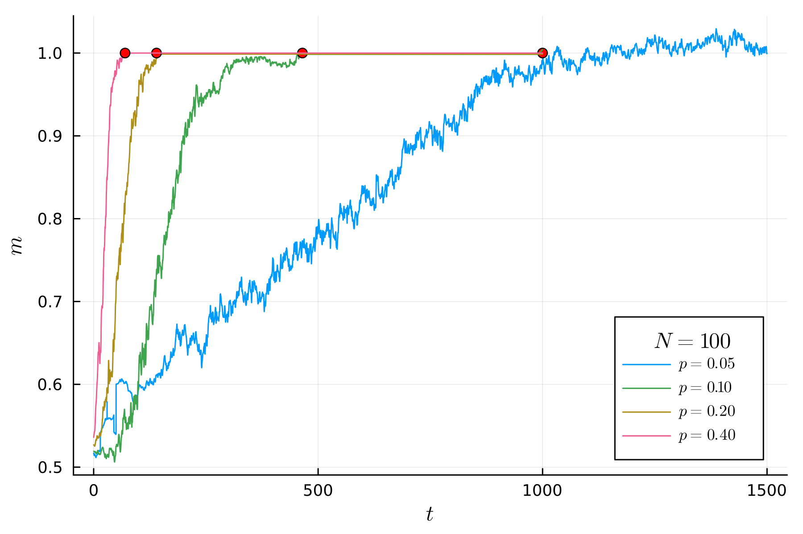
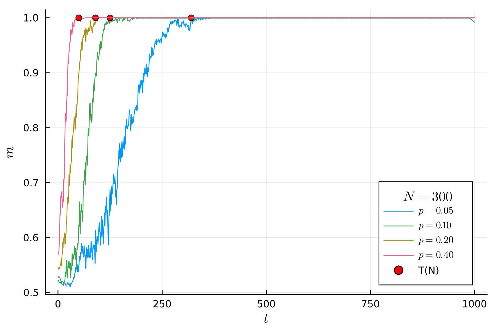
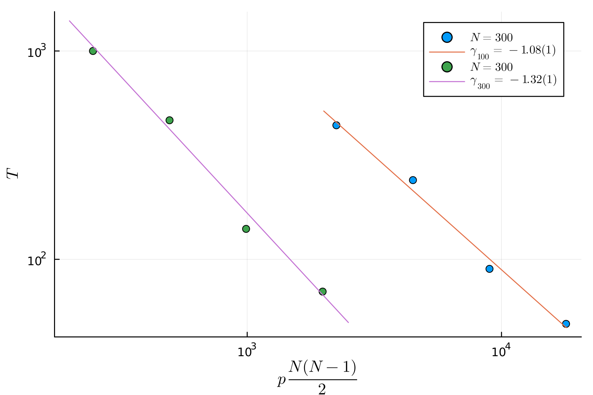

# Trabajo Práctico 6
## Problema 1

### Inciso 1a
Vamos a mostrar primero curvas que corresponden a dos realizaciones independientes del experimento (sin promediar). Esto para tener una intuición general del comportamiento del sistema. Los parámetros son los que indica el ejercicio (es decir, $p = 0.2, N = 300, \epsilon = 0.01$)

Para la integración de las ecuaciones de movimiento, utilizamos un $\delta t = 0.01$ s/step.

A $t=0$, como es de esperar, $m\approx 0.5$, lo que indica un estado inicial de los osciladores $\theta_0$ uniformemente distribuido entre $0 y 1$.

En la evolución temporal, podemos ver que hay una gran cantidad de ruido y variabilidad en los datos en las instancias previas a la sincronización, la cual ocurre cuando $m=1$. 

Lo siguiente que podemos hacer es mirar la forma de la curva promediada de los experimentos realizadas en una misma red. 

La estadística reduce el ruido en la medición, y hace que la curva sature en $1$ a un ritmo más gradual.

Lo que queda es hacer el promedio sobre todas las redes y todas las realizaciones.

La estadística normaliza en gran medida el ruido de las mediciones, y ahora podemos ver una evolución mucho más suave de la curva. El $T$ de sincronización se toma desde la gráfica, con un error estimado a partir de la dispersión del $T$ hallados en cada red. 

$$T = 310(20)\;s$$

### Inciso 1b

Lo que sigue es repetir el experimento sobre dos tamaños distintos ($N=100$ y $N=300$), con $p$ variable. 

En ambos casos, los puntos rojos están indicando los $T$ de sincronización estimados para cada $p$.

Ahora, con estos datos, podemos ajustar leyes de potencia para las curvas $T(p,N)$, para los dos casos estudiados. Para este ajuste, se va a utilizar como variable independiente el número esperado de enlaces de la red $$l =\frac{ pN(N-1)}{2}$$

El exponente $\gamma$ del sistema de 100 osciladores es pequeño comparado con el valor esperado según el artículo de referencia ($\approx$ 1.33). Eso se puede deber a algún comportamiento anómalo del tamaño chico del sistema. Para el sistema de 300 osciladores, el exponente calculado es consistente.